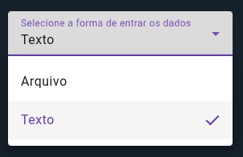
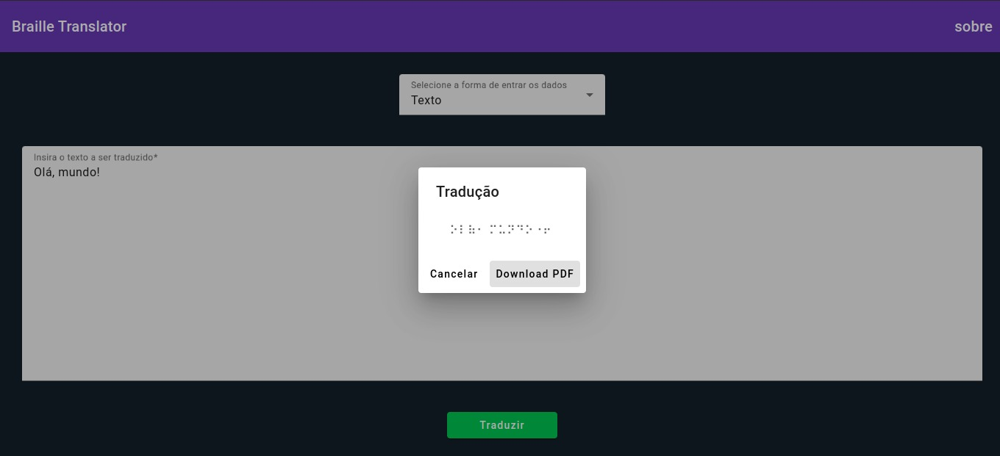

# [Braille Translator](https://cassianodess.github.io/braille-translator-web/)

## Como usar?
### 1. Selecione uma forma de entrar o texto a ser traduzido:

    
    Arquivo:
        - Formato texto: .txt, .docx ou .pdf
        - Formato imagem: png, jpeg, jpg...
    
    Texto:
        - Usuário insere o texto a ser traduzido.
    

### 2. Entrada de dados e tradução:

* Após a entrada de dados, o botão de "Traduzir" será habilitado, ao clicar será exibida a tradução em Braille, podendo fazer o download no formato PDF. 

## Mobile APP
* [Android]()
* [IOS]()
## Desktop APP
* [Linux]()
* [Windows]()
* [Mac]()
